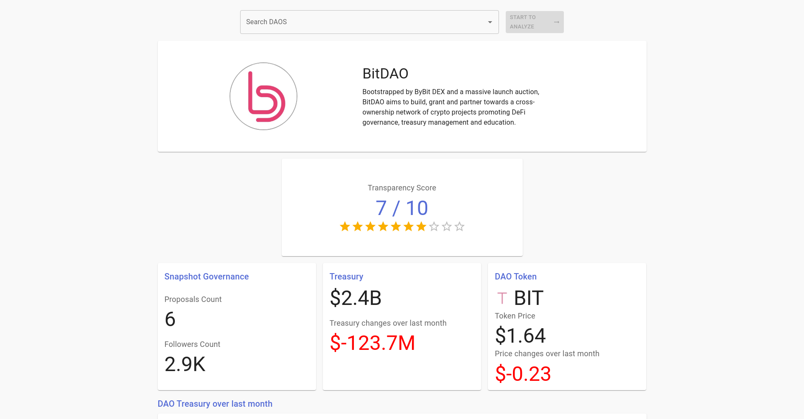

## DAO Transparency Dashboard

DAO Transparency Dashboard powered by **Covalent API**.



## Tech Stack

- Typescript
- Nextjs
- Reactjs
- Redux
- Material UI
- Prisma

## Running Locally

1.  Clone the project

```bash
git clone https://github.com/soheil555/DAO-transparency-dashboard.git
cd DAO-transparency-dashboard
```

2. Create .`env` file

   ```bash
   cp .env.example .env
   ```

3. Edit `.env` file

   ```bash
   NEXT_PUBLIC_COVALENT_KEY= #get it from https://www.covalenthq.com/
   CHROME_PATH= #not required if you don't want to update DAO data
   DATABASE_URL= #postgres database url
   ```

   > By default project uses Postgres as database for storing DAOs initial informations. But you can change it to any Prisma supported databases by editing `prisma/schema.prisma` file.

4. Install dependencies and seed database

   ```bash
   npm run install-seed
   ```

5. Start development server

   ```bash
   npm run dev
   ```

## DAOs Initial Informations

DAO name, description, treasury and governance addresses are scraped from [DeepDAO.io](https://deepdao.io/) Top organizations list.

Scraping script can be found in `prisma/seed.ts` file.

## License

Available under the MIT license. See the `LICENSE` file for more info.
